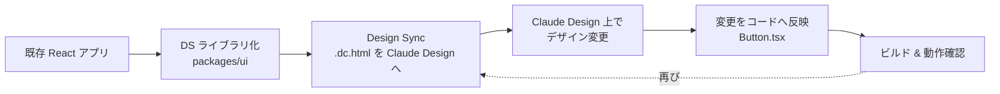
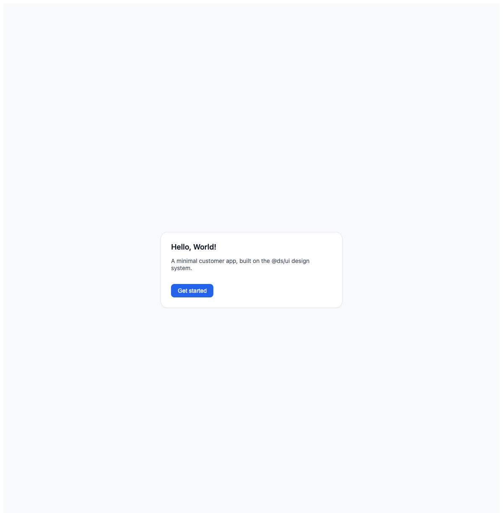
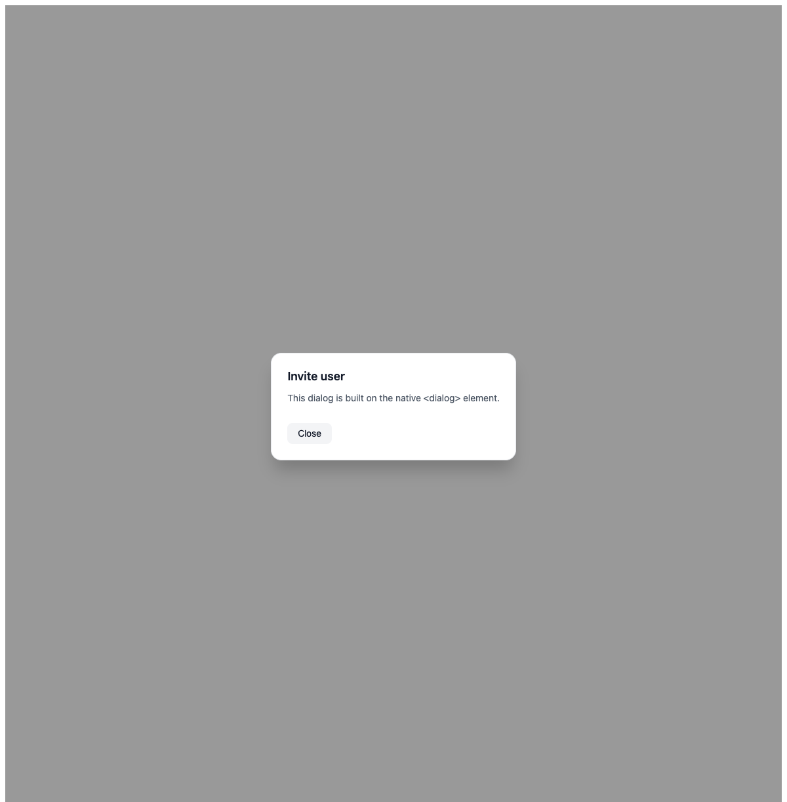
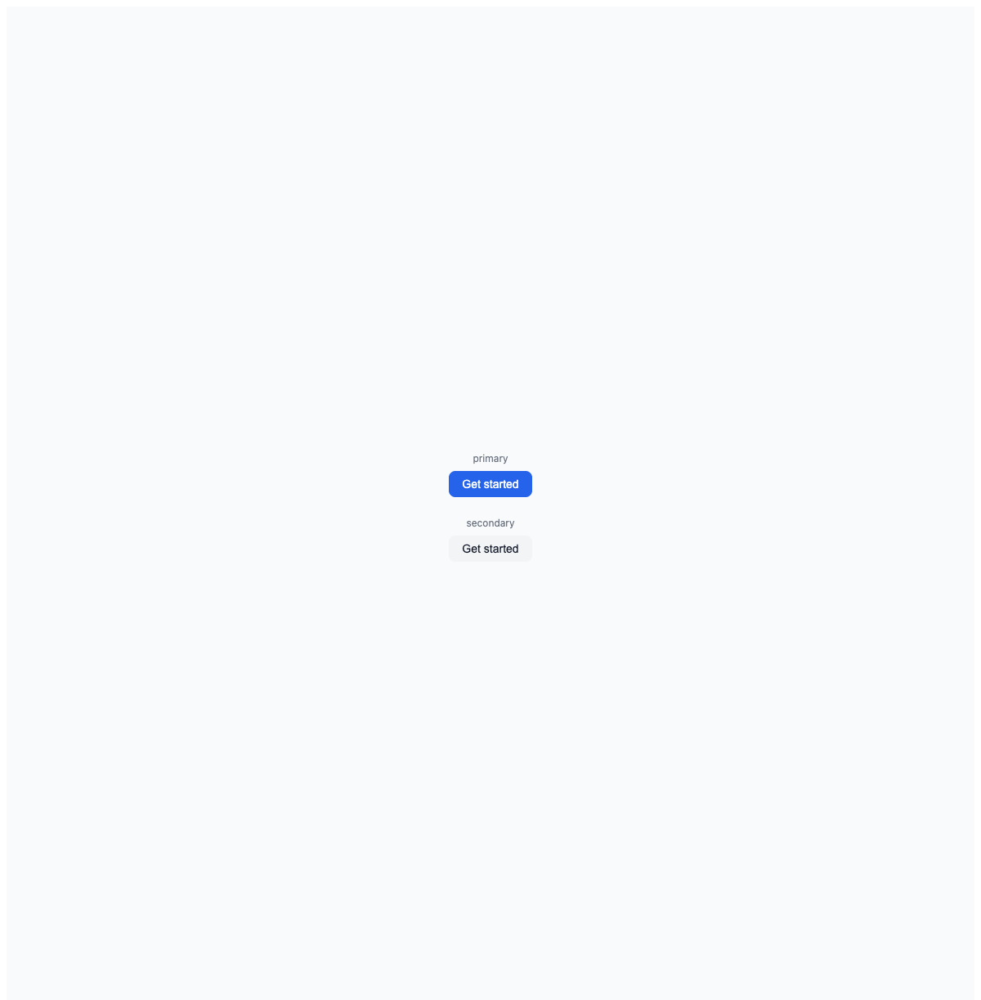
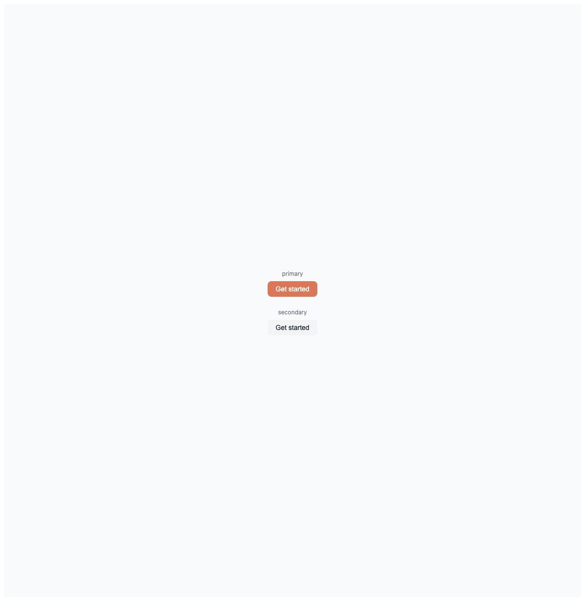
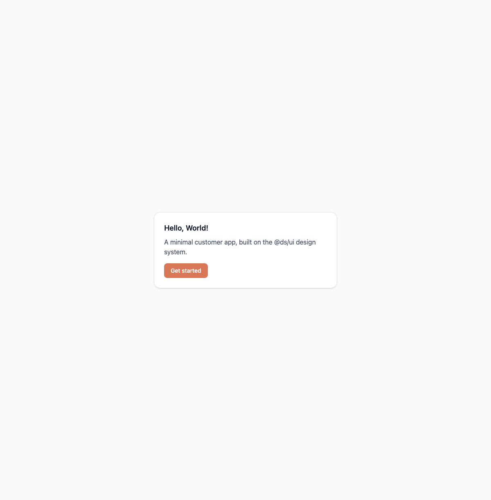

# 既存の React アプリを Claude Design でデザイン変更する

すでに動いている React アプリのデザインを、[Claude Design](https://claude.ai/design) を使って変更し、その変更をコードに反映するまでの一連の流れを、実際にゼロから作りながら検証した記録です。「デザインシステムを Claude Design に取り込む → Claude Design 上で見た目を変える → コードに戻す」という往復（round-trip）が本当に成立するのか、どこがハマりどころなのかを、実行したコマンドと実際に出たエラーごと残します。

対象読者は、React + TypeScript のフロントエンドを触っていて、Claude Design を既存プロジェクトに導入できるか検討している人です。

## 全体像



ポイントは **Claude Design が受け取るのは生の `.tsx` ではない**ということです。Design Sync は React コンポーネントを Claude Design 独自の `.dc.html`（Design Components 形式）に変換してアップロードします。ここを理解していないと最初の一歩で詰まります。

## 前提：既存アプリを用意する

検証用に、まず最小の React アプリを作ります。スタックは Claude Design と相性が確認できている **Vite + React 19 + TypeScript + Tailwind CSS v4**。

```bash
npm create vite@latest frontend -- --template react-ts
cd frontend
npm install @tailwindcss/vite tailwindcss
```

`vite.config.ts` に Tailwind v4 のプラグインを追加し、`src/index.css` を1行にします。

```ts
// vite.config.ts
import tailwindcss from "@tailwindcss/vite";
export default defineConfig({ plugins: [react(), tailwindcss()] });
```

```css
/* src/index.css — Tailwind v4 はこの1行だけ */
@import "tailwindcss";
```

`components/ pages/ hooks/` という構成で `Hello, World!` を表示するだけのアプリを作り、`npm run build` とブラウザ表示で動作を確認しておきます。ここは普通の React 開発なので詳細は省きます。

## ステップ1：デザインシステムライブラリの形にリファクタリング

Claude Design は「デザインシステム（＝再利用可能なコンポーネント群）」を扱います。単一アプリのままでは取り込みの単位がぼやけるので、**共有 UI ライブラリと、それを消費するアプリ**に分離します。

npm workspaces を使ったモノレポにしました（Turborepo や pnpm、nx は入れていません。標準機能で足ります）。

```
repo/
├── package.json          # "workspaces": ["packages/*", "apps/*"]
├── apps/
│   ├── admin/            # @ds/ui を消費（Card + Button + Dialog）
│   └── customer/         # @ds/ui を消費（Card + Button）
└── packages/
    └── ui/               # @ds/ui : Button / Card / Dialog
```

`packages/ui` が今回の「デザインシステム」です。コンポーネントは Tailwind のユーティリティクラスでスタイリングしています。

```tsx
// packages/ui/src/Button.tsx
export function Button({ variant = "primary", className = "", ...props }) {
  const base = "inline-flex items-center justify-center rounded-lg px-4 py-2 ...";
  const variants = {
    primary: "bg-blue-600 text-white hover:bg-blue-700 focus:ring-blue-500",
    secondary: "bg-gray-100 text-gray-900 hover:bg-gray-200 ...",
  };
  return <button className={`${base} ${variants[variant]} ${className}`} {...props} />;
}
```

`Dialog` はライブラリを足さず、**ネイティブの `<dialog>` 要素**で実装しました（フォーカストラップやポータルはブラウザがやってくれる）。

### モノレポ化でハマった2点

**1. Tailwind v4 がライブラリのクラスを拾わない。** Tailwind v4 は自動でソースを走査しますが、その基準はアプリのディレクトリです。`packages/ui` はアプリの外にあるため、そのままではライブラリ側のクラス（`bg-blue-600` など）が CSS に出力されません。各アプリの CSS で `@source` を追加して解決します。

```css
/* apps/customer/src/index.css */
@import "tailwindcss";
@source "../../../packages/ui/src";  /* DS ライブラリのソースも走査する */
```

**2. 新しい TypeScript の型エラー2つ。** ビルド時に踏みました。

- `TS5011: rootDir must be explicitly set` → ライブラリの `tsconfig.build.json` に `"rootDir": "src"` を明示。
- `TS2882: Cannot find ... side-effect import of './index.css'` → 各アプリに `src/vite-env.d.ts`（`/// <reference types="vite/client" />`）を追加。Vite の scaffold には入っていますが、アプリを手書きすると忘れがちです。

`npm run build` で ui（`tsc` → `dist/`）と両アプリ（`tsc` + `vite build`）が全て通り、ブラウザで customer / admin の表示を確認できたら準備完了です。

## ステップ2：Design Sync（Claude Design に取り込む）

ここが本題です。ローカルの `@ds/ui` を Claude Design に同期します。

### `.dc.html` という形式を知る

Claude Design のプロジェクトは `.dc.html` ファイルで構成されます。これは普通の HTML ではなく、**`support.js` ランタイム + `<x-dc>` テンプレート + `{{ }}` テンプレートホール**という独自形式です。

```html
<!-- @dsCard group="Components" -->   <!-- Design System ペインのカード索引に載る -->
<!DOCTYPE html>
<html>
  <head>
    <script src="./support.js"></script>   <!-- dc ランタイム -->
  </head>
  <body>
    <x-dc>
      <helmet data-dc-atomics>
        <style>
          .btn-primary { background: #2563eb; color: #fff; }
        </style>
      </helmet>
      <button class="btn btn-primary">{{ label }}</button>
    </x-dc>
    <script type="text/x-dc" data-dc-script data-props='{ "label": {"editor":"text","default":"Get started"} }'>
      class Component extends DCLogic {
        renderVals() { return { label: this.props.label ?? "Get started" }; }
      }
    </script>
  </body>
</html>
```

React コンポーネントの Tailwind クラスを、この `.dc.html` の `<helmet><style>` に「見た目が同じになるように」移植するのが Design Sync の実体です。`{{ label }}` のようなテンプレートホールにすると、Claude Design のエディタ上で値を直接編集できるようになります。

### 同期の手順

同期は以下の順序で行います（本記事では Claude Code から MCP ツール経由で実行しました。記事によっては `/design-login` → `/design-sync` というスラッシュコマンドで案内される流れと同じです）。

1. **`finalize_plan`** — これから書き込むパスの集合を確定する（`Button.dc.html`, `Card.dc.html`, `Dialog.dc.html`, `support.js`）。署名付きの `plan_token` が返る。
2. **`create_support_js`** — `support.js` ランタイムをプロジェクトに設置する（内容は自分で書かない。サーバが正しいバンドルを書き込む）。
3. **`write_files`** — `.dc.html` を書き込む。
4. **`render_preview` + ブラウザ** — 各ファイルをレンダリングして目視確認する。

3つのコンポーネントを同期し、Claude Design 上で正しくレンダリングされることを確認できました。

| Card | Dialog |
|---|---|
|  |  |

Card は customer アプリと同一の見た目、Dialog はネイティブ `<dialog>` をディム背景付きモーダルとして再現できています。

### ハマりどころ：ツール群が2系統ある

Claude Design には `finalize_plan` / `write_files` を持つツールが **2系統**あります。片方の `finalize_plan` が返したトークンを、もう片方の `create_support_js` に渡すと `plan_token is malformed` で弾かれます。**同一系統に統一する**のが正解です（`create_support_js` と `render_preview` を持つ系統に揃える）。

## ステップ3：Claude Design で UI を変更する

同期できたら、Claude Design 側でデザインを変えます。今回は **プライマリボタンの色を 青 (#2563eb) → テラコッタ (#D97757)** に変更しました。

`.dc.html` の `.btn-primary { background: ... }` を書き換えて `write_files` → `render_preview` で確認します。

| 変更前（青） | 変更後（テラコッタ） |
|---|---|
|  |  |

実際に Claude Design を使う場合は、この編集を Web エディタ上でマウスやプロンプトで行い、右上の「Share」から**コードへの同期用プロンプト**を取得します。

## ステップ4：変更をコードに反映する

Claude Design 側の変更（`#2563eb → #D97757`）を、React コードに戻します。反映先は `packages/ui/src/Button.tsx` の `primary` バリアント1箇所だけです。`Button` は customer / admin 両アプリの単一ソースなので、ここを直せば両方に伝播します。

```diff
- primary: "bg-blue-600 text-white hover:bg-blue-700 focus:ring-blue-500",
+ // Brand color synced from Claude Design: terracotta #D97757
+ primary: "bg-[#D97757] text-white hover:bg-[#C15F3D] focus:ring-[#D97757]",
```

テラコッタは Tailwind の標準カラーに無いので、arbitrary value（`bg-[#D97757]`）で指定します。

> **注意**：デザイン→コードの方向は、コード→デザイン（`write_files` 一発）ほど自動化されていません。Claude Design の「Share」からプロンプトをコピーして Claude Code に貼り付け、初回はセッション再起動 + MCP 認証が必要になる、という手順が案内されることがあります。往復のうち「戻す」側のほうが手間がかかる、と認識しておくとよいです。

## ステップ5：新しいコードで動作チェック

`npm run build -w customer` でビルドし、ブラウザで確認します。



customer アプリの「Get started」ボタンがテラコッタになりました。**Claude Design で加えた変更が、React コードを経由して実アプリに反映された**ことが確認できます。往復の成立です。

## ハマりどころ・注意点まとめ

- **Claude Design が扱うのは `.tsx` ではなく `.dc.html`。** Tailwind クラスを `<helmet><style>` に移植する変換が入る。これが Design Sync の実体。
- **`finalize_plan` → `create_support_js` → `write_files` → `render_preview` の順序**を守る。トークンは同一ツール系統で統一する。
- **Tailwind v4 のモノレポは `@source` が必須。** ライブラリのクラスがアプリの CSS に出力されない。
- **手書き Vite アプリは `vite-env.d.ts` を忘れずに。** CSS の side-effect import が TS2882 で落ちる。
- **デザイン→コードの反映は半手動。** コード→デザインほど1コマンドでは終わらない。
- **利用環境の制約：** Amazon Bedrock / Google Cloud / Microsoft 経由では利用できない（基盤ツールが claude.ai に到達できないため）。claude.ai アカウントでの認可が前提。
- **初回同期の時間：** 小規模なら約10分、大規模リポジトリでは数時間かかることがある。

## まとめ

既存の React アプリでも、(1) デザインシステムライブラリの形に整え、(2) `.dc.html` に変換して Claude Design に同期すれば、Claude Design 上でのデザイン変更とコードへの反映という往復が成立します。単一ソース（`@ds/ui`）にコンポーネントを寄せておくと、色1つの変更が全アプリに1箇所で伝播するので、デザインシステムとしての恩恵がそのまま効きます。

一方で、`.dc.html` への変換が入ること、デザイン→コードの反映が半手動であること、実行環境が claude.ai 前提であることは、導入前に押さえておくべき現実です。
