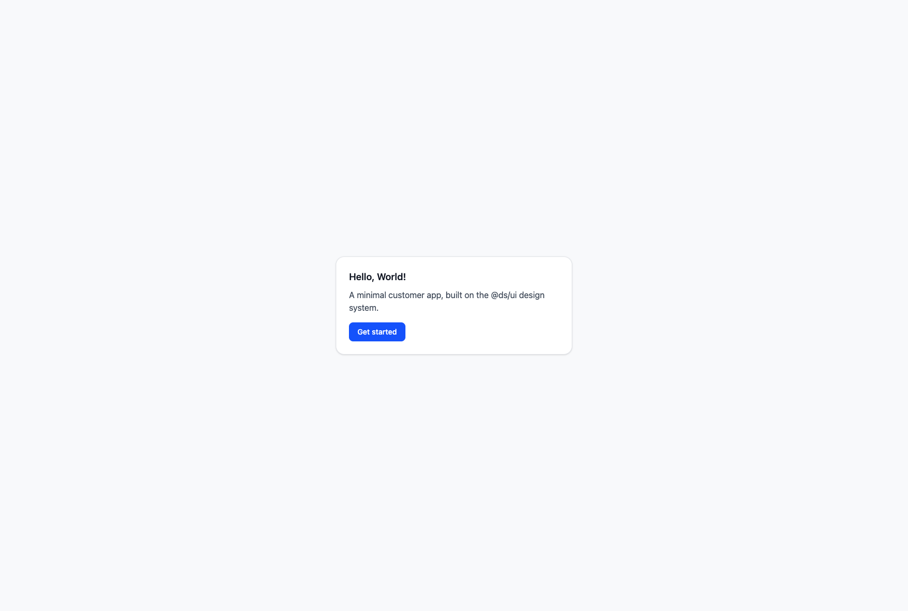
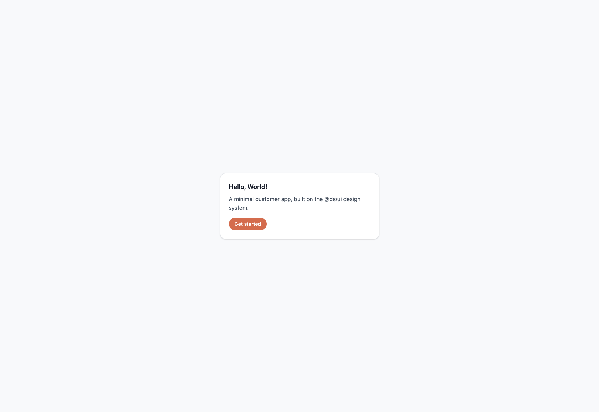
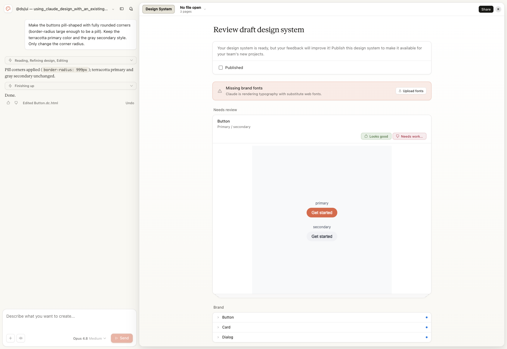

# Claude Code × Claude Design で既存 React アプリのデザインを変える — エンジニアの操作手順

Claude Code（コードを触るエージェント）と Claude Design（ブラウザ上のデザインツール）を組み合わせると、**すでに動いている React アプリのデザインを、コードとデザインの両側から往復しながら変えられます**。

この記事は「AI が何をやったか」ではなく、**それを操作するエンジニアが何をすればいいか**に絞って書きます。具体的には——着手前に何を知っておくべきか、Claude Code に何を指示すればいいか、Claude Design（ブラウザ）で自分は何を操作すればいいか。手順を最初に一覧で示し、詳細を順に説明します。

各アクションには誰がやるかのラベルを付けます：

- 🧑‍💻 **エンジニアが手を動かす**（設定・接続・レビュー・判断）
- 💬 **Claude Code に指示する**（コードの操作）
- 🎨 **Claude Design（ブラウザ）で操作する**（デザインの変更）

## まず：どのアプリを、どう変えたか

題材は、共有 UI ライブラリ `@ds/ui`（Button / Card / Dialog）と、それを使う2つの最小アプリ（`customer` / `admin`）です。この `customer` アプリのボタンのデザインを、次のように変えました。

| Before（青・角丸小） | After（テラコッタ・ピル型） |
|---|---|
|  |  |

変更は2点です。

1. **ブランドカラー**：青 `#2563eb` → テラコッタ `#D97757`
2. **角丸**：`rounded-lg`（8px）→ ピル型（`border-radius: 999px`）

ポイントは、この見た目の変更を **Claude Design（ブラウザ）側でデザイナー的に指示し、その結果をコードに落とした**こと。コードを直接いじる前に、デザインをデザインの場所で決められます。

## 手順の全体像（チェックリスト）

細部に入る前に、エンジニアがやることの地図を渡します。

| フェーズ | 何をする | 誰が / どこで | 成果物 |
|---|---|---|---|
| A | 既存アプリを DS ライブラリ構成に整える | 💬 Claude Code | `packages/ui` + `apps/*` の monorepo |
| B | DS ライブラリを Claude Design に同期する | 💬 Claude Code | Claude Design 上の `.dc.html` |
| C | 普段の Chrome に Playwright を接続する | 🧑‍💻 エンジニア | ログイン済みブラウザを AI が操作可能に |
| D | Claude Design 上でデザインを変更する | 🎨 ブラウザ | 変更された `.dc.html` |
| E | 変更をコードに反映する | 💬 Claude Code | 更新された `packages/ui` |
| F | ビルドして実ブラウザで動作確認 | 💬 Claude Code + 🧑‍💻 目視 | 変更が反映されたアプリ |

A・B・E・F は Claude Code に任せられます。**エンジニアが自分の手で行う核心は C（ブラウザ接続）と D（デザインの意思決定）** です。

## 着手前に知っておくべき5つの前提

つまずきの大半はここを知らないことから来ます。

1. **Claude Design が扱うのは `.tsx` ではなく `.dc.html`。** あなたの React コンポーネントは、Claude Design 独自の Design Components 形式（HTML + 専用ランタイム）に**変換**されて取り込まれます。「React をそのままアップする」ものではありません。
2. **デザインシステムの形にする必要がある。** 単一アプリのままより、再利用コンポーネントを1つのライブラリ（`packages/ui` など）に寄せた方が、同期の単位が明確で、変更が全アプリに1箇所で伝播します。
3. **claude.ai アカウントが前提。** Amazon Bedrock / Google Cloud / Microsoft 経由では利用できません（基盤ツールが claude.ai に到達できないため）。
4. **デザインを触る／確認するには「自分のログイン済みブラウザ」を AI に繋ぐ必要がある。** Claude Design のエディタは claude.ai のログインセッションが要ります。後述の Playwright MCP Browser Extension で接続します。これをやらないと、AI はエディタ UI を見られず、デザインの確認・操作ができません。
5. **Tailwind v4 を使うなら下準備が要る。** モノレポでライブラリのクラスを拾わせる `@source` の追加など（詳細はフェーズ A）。

## 詳細手順

### フェーズ A：既存アプリを DS ライブラリ構成に整える

💬 **Claude Code への指示例**：

> この単一の React アプリを、npm workspaces のモノレポに再構成して。共有 UI を `packages/ui`（`@ds/ui`：Button / Card / Dialog）に切り出し、`apps/customer` と `apps/admin` がそれを使う形にして。追加のビルドツール（Turborepo 等）は入れず標準機能で。

🧑‍💻 **エンジニアがやること**：出てきた PR をレビューする。特に次の下準備が入っているか確認：

- Tailwind v4 で、各アプリの CSS に `@source "../../../packages/ui/src";`（ライブラリのクラスをアプリ側の CSS 生成対象に含める）
- 手書きした Vite アプリに `src/vite-env.d.ts`（`/// <reference types="vite/client" />`）
- ライブラリの `tsconfig` に `"rootDir": "src"`

> これらが無いと後でビルドエラー（`TS2882`、`TS5011`）やスタイル抜けが起きます。エンジニアはレビュー時にこの3点をチェックリストにしておくと早い。

### フェーズ B：DS ライブラリを Claude Design に同期する

💬 **Claude Code への指示例**：

> `@ds/ui` の Button / Card / Dialog を Claude Design に同期して。既存のチームのプロジェクトは汚さず、この repo 用に新規のデザインシステムプロジェクトを作って。

🧑‍💻 **エンジニアがやること**：初回に claude.ai のデザインシステムアクセス認可を一度承認する（`/design-login` 相当）。どのプロジェクトに同期するか聞かれたら「新規作成」を選ぶ。

内部では Claude Code が「書き込みパスの確定 → ランタイム設置 → `.dc.html` 書き込み」を行います。エンジニアはコマンドの中身を覚える必要はなく、**同期先プロジェクトの選択**だけ意思決定すれば十分です。

### フェーズ C：普段の Chrome に Playwright を接続する（ここは人の作業）

デザインを触る前に、AI があなたのログイン済みブラウザを操作できるようにします。**Playwright MCP の Browser Extension** を使います。

🧑‍💻 **エンジニアがやること**：

1. Playwright MCP サーバの起動引数に `--extension` を足す：

   ```json
   {
     "mcpServers": {
       "playwright": {
         "command": "npx",
         "args": ["@playwright/mcp@latest", "--extension"]
       }
     }
   }
   ```

2. Chrome / Edge に「Playwright Extension」をインストールする。
3. Claude Code を再起動して、新しい設定を有効化する。
4. 拡張のアイコンから、接続を許可する（対象タブに Claude Design を開いておく）。

💬 **確認の指示例**：

> ブラウザのタブ一覧を取得して、接続できているか確認して。

自分の実タブ（開いている Claude Design のタブなど）が見えれば接続 OK。`about:blank` が1件だけなら未接続なので、拡張の接続をやり直します。

> **なぜ必要か**：この接続をしないと、AI は claude.ai に未ログインの別ブラウザしか使えず、Claude Design のエディタ UI を見られません。後述の「No cards」のようなエディタ側のエラーも、接続していないと誰も気づけません。

### フェーズ D：Claude Design 上でデザインを変更する（あなたの意思決定）

🎨 **ブラウザで操作すること**：実ブラウザで Claude Design のプロジェクトを開き、左下のチャット欄（「Describe what you want to create...」）に、変えたいデザインを自然言語で指示します。

今回入れたプロンプト（ピル型化）：

> Make the buttons pill-shaped with fully rounded corners. Keep the terracotta primary color and the gray secondary style. Only change the corner radius.

数秒で Claude Design が該当コンポーネントの `.dc.html` を編集し、プレビューがその場で変わります。



🧑‍💻 **エンジニアがやること**：プレビューを目視して、意図どおりか判断する。ここは**デザインの意思決定**なので人が主役です。良ければ次へ、違えばチャットで追加指示（「もう少し角丸を控えめに」等）。

> コードを1行も書かずに、色や角丸を「言葉で」回せるのがこのフェーズの価値です。変更は外科的で、指示していない箇所（色や余白）は触られません。

### フェーズ E：変更をコードに反映する

💬 **Claude Code への指示例**：

> Claude Design 側でボタンをピル型に変更した。その変更を `packages/ui` のコードに反映して。

Claude Code が Claude Design 側の変更を読み取り、対応する Tailwind クラスに落とします。今回の反映は `Button` の base クラス1箇所だけ：

```diff
- "inline-flex items-center justify-center rounded-lg px-4 py-2 ...";
+ "inline-flex items-center justify-center rounded-full px-4 py-2 ...";
```

`Button` は customer / admin 両アプリの単一ソースなので、**この1箇所で両アプリに反映**されます。色を変えたときも同様に `primary` バリアントの1行（`bg-[#D97757]`）だけでした。

🧑‍💻 **エンジニアがやること**：diff をレビューする。デザイン→コードの反映は完全自動ではないので、「余計な箇所を変えていないか」を人が見るのが安全です。

### フェーズ F：ビルドして実ブラウザで動作確認

💬 **Claude Code への指示例**：

> customer アプリをビルドして、実ブラウザで表示を確認して。

🧑‍💻 **エンジニアがやること**：接続済みの実ブラウザで、変更が反映されているか目視。冒頭の After 画像（テラコッタのピル型ボタン）がゴールです。ここまでで往復が1周します。以降は D→E→F を回すだけです。

## つまずいたときの対処（症状から引く）

エンジニアが画面で見る「症状」から、原因と打つ手を引けるようにしておきます。

| 症状（あなたが見るもの） | 原因 | 打つ手 |
|---|---|---|
| Claude Design の Design System に「**No cards yet**」。`.dc.html` は同期済みなのにカードが出ない | カード索引 `_ds_manifest.json` が未生成（headless 同期経路では自動生成の self-check が走らない）。console に `GetFile 404` | 💬「`register_assets` でカードを明示登録して」と Claude Code に頼む |
| `plan_token is malformed` で書き込みが弾かれる | Claude Design ツールの2系統を混在させ、トークンを取り違えた | 💬「同一ツール系統に統一して」 |
| 色や角丸を変えたのにアプリに出ない | Tailwind v4 がライブラリのソースを走査していない | 💬「app の CSS に `@source` を追加して」 |
| ビルドが `TS2882`（css の side-effect import）で落ちる | `vite-env.d.ts` が無い | 💬「各アプリに `vite-env.d.ts` を追加して」 |
| タブ一覧が `about:blank` だけ | Playwright 拡張が未接続 | 🧑‍💻 拡張の接続を押す／`--extension` 付きで MCP を再起動 |
| プレビューは正しく見えるのにエディタで「No cards」等に気づけない | headless のプレビュー URL しか見ていない | 🧑‍💻 実ブラウザ（ログイン済み）に接続して確認する |

> 対処の多くは「💬 Claude Code に一言頼む」で済みます。エンジニアが暗記すべきは、症状と、それが Claude Code 案件か自分の作業（拡張接続）かの切り分けです。

## まとめ：役割分担で捉える

この往復を再現可能な型にすると、こう分かれます。

- **💬 Claude Code が担う**：モノレポ化、Claude Design への同期、デザイン変更のコードへの反映、ビルド。コードとツール操作はほぼ任せられる。
- **🎨 Claude Design（ブラウザ）で人がやる**：デザインの変更をチャットで指示し、プレビューで良否を判断する。ここが人の意思決定。
- **🧑‍💻 エンジニアの固有作業**：着手前の前提理解、Playwright 拡張でのブラウザ接続、PR / diff のレビュー、そして「どう変えたいか」というデザイン判断。

エンジニアが押さえるべき勘所は2つだけです。**(1) 自分のログイン済みブラウザを AI に繋ぐこと**（これで初めてデザインを触れる・確認できる）、**(2) デザインの意思決定は自分が握ること**（コード反映やビルドは任せてよい）。この2点さえ外さなければ、既存アプリのデザイン変更は「言葉で指示して往復するだけ」の作業になります。
