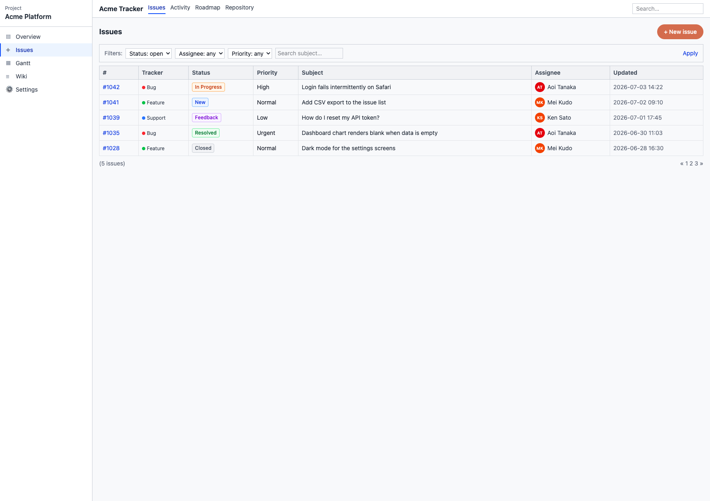
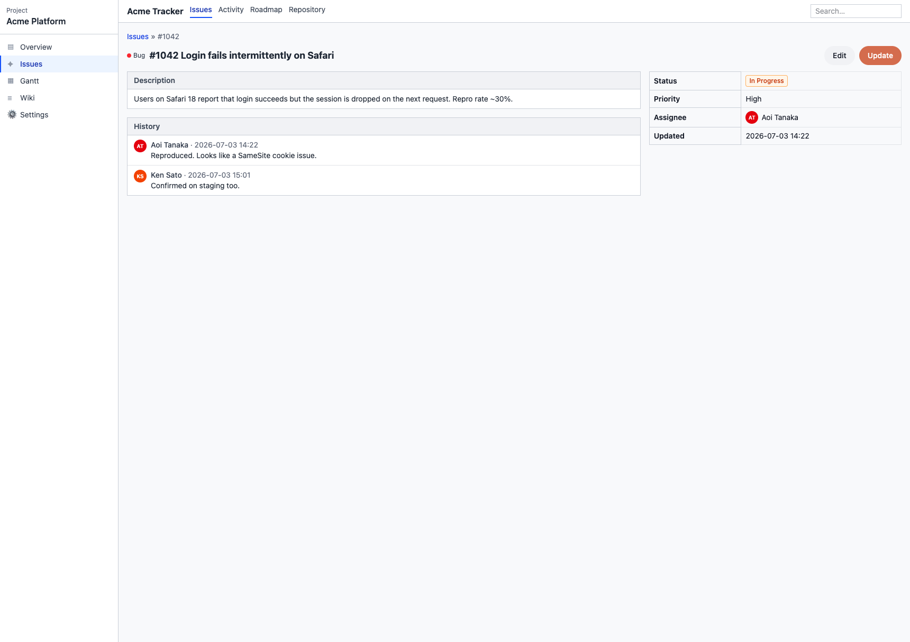
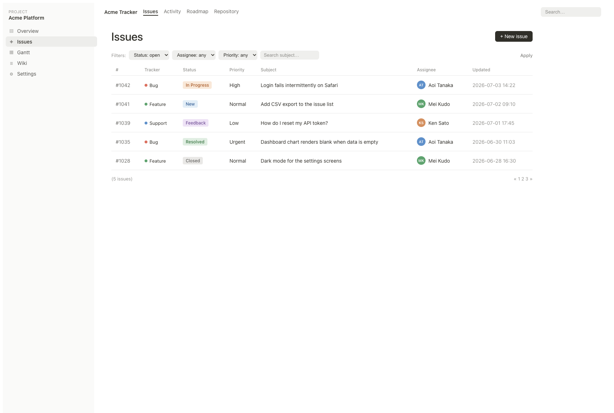
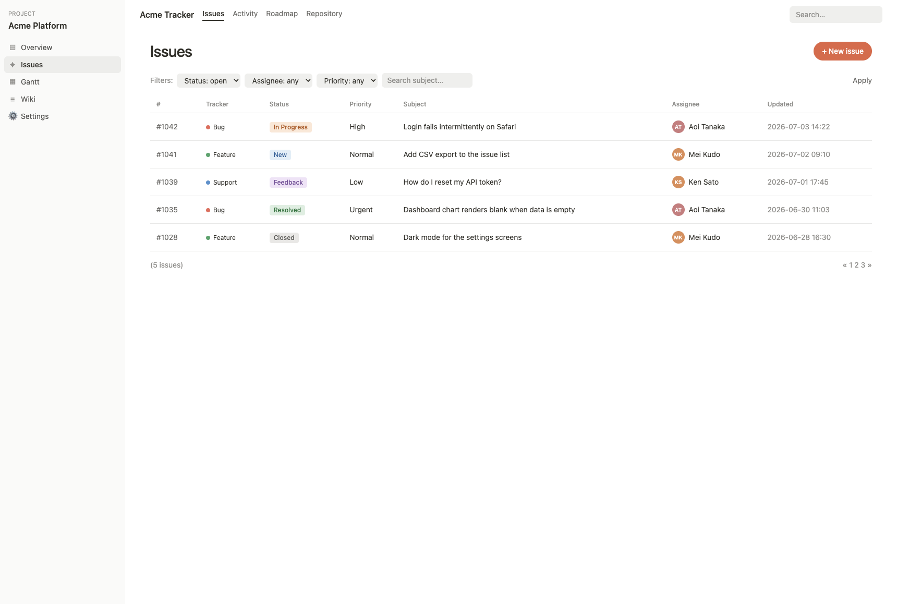
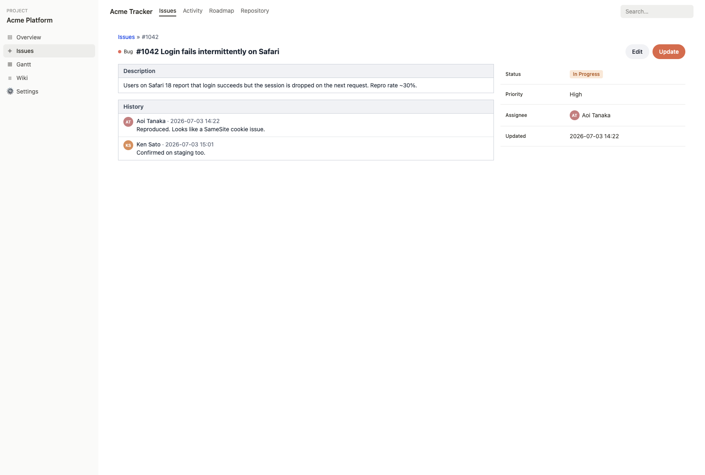
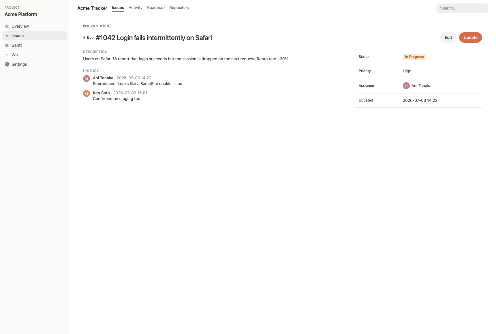

# スケール検証ログ：複雑なアプリ（Redmine 風チケット管理）を Claude Design で Notion 風に変える

Issue #1 で確立したワークフロー（DS ライブラリ化 → Design Sync → Claude Design で変更 → コード反映 → 動作確認）が、**相当に複雑なアプリの大規模デザイン変更**でも通用するかを検証する記録です。各ステップをスクリーンショットと操作ログで残します（Issue #9）。

- **対象**：React 製チケット管理 UI（サイドバー / 多カラムの一覧テーブル / フィルタ / チケット詳細 / タブ）
- **変更の方向性**：Redmine 風（密・境界線多め・グレー/青のコーポレート） → Notion 風（余白・境界線少なめ・洗練タイポ）
- **プロセス**：Claude Design 側の変更は Playwright MCP Browser Extension でログイン済み実ブラウザを操作して実施

---

## フェーズ 1：Redmine 風アプリと `@ds/ui` の拡張

### やったこと

既存モノレポ（`packages/ui` + `apps/*`）に、新しいアプリ `apps/tracker` を追加し、`@ds/ui` に一覧・詳細で使う再利用コンポーネントを拡張した。

- **`@ds/ui` に追加**：`Badge`（ステータス）/ `Tag`（トラッカー種別）/ `Avatar`（イニシャル）/ `SidebarItem` / `Toolbar` / `Table`（`Table/THead/TBody/TR/TH/TD` の密なテーブル基本要素）。
- **`apps/tracker` の画面**：
  - サイドバー（Overview / Issues / Gantt / Wiki / Settings）
  - チケット一覧：フィルタツールバー + 多カラムの密なテーブル（#ID / Tracker / Status / Priority / Subject / Assignee / Updated）+ ステータスバッジ + ページャ
  - チケット詳細：パンくず + 説明パネル + 履歴 + プロパティ表
- **設計方針**：テーブルのセル境界・密度・バッジ色などの「Redmine らしさ」を `@ds/ui` 側の CSS に持たせ、**後の Notion 化が `@ds/ui` の変更だけで全画面に伝播する**ようにした。

### 動作チェック（実ブラウザ）

`npm run build`（ui: `tsc`→`dist/`、tracker: `tsc`+`vite build`）が通過。CSS は約 15KB で、`@source` により `@ds/ui` の全クラスが出力されていることを確認。

一覧（Redmine 風・密なテーブル）：

詳細（プロパティ表・履歴）：

### この時点の所見

- シンプル版（Button/Card/Dialog）に比べ、コンポーネント数・画面の情報密度が大きく増えた。特に**テーブルは要素数が多く**、Design Sync / デザイン変更でここがどう扱われるかが焦点になりそう。
- 「スタイルを `@ds/ui` に寄せる」方針は、複雑アプリでこそ効くはず（変更の伝播点を1箇所に集約できる）。次フェーズ以降で検証する。

---

## フェーズ 2：Design Sync（複雑画面の取り込み）

シンプル版では個別コンポーネント（Button/Card/Dialog）を `.dc.html` にしたが、複雑アプリでは **画面まるごと**（チケット一覧 = サイドバー + タブ + フィルタ + 多カラムの密なテーブル + バッジ + アバター + ページャ）を1つの `.dc.html` として同期した。理由は、大規模なデザイン変更は「レイアウト・情報密度・要素間の関係」を含むので、コンポーネント単体より**合成された画面の上で回した方が効く**ため。

新規 Claude Design プロジェクトを作成し、`finalize_plan → create_support_js → write_files → register_assets` で同期。実ブラウザで開くと、Redmine 風の一覧画面がそのままカードとしてレンダリングされた。

### 所見（シンプル版との差）

- **1枚の `.dc.html` が大きくなった**（約150行、テーブル5行 × 7列 + サイドバー等）。それでも同期・レンダリングは問題なし。
- `register_assets` はシンプル版と同じく必要（headless 経路では `_ds_manifest.json` の self-check が走らない）。

## フェーズ 3：Claude Design で Notion 風に変更（実ブラウザ・チャット）

Playwright MCP Browser Extension でログイン済みブラウザに接続し、Claude Design のチャットに一括で指示した：

> Redesign this issue tracker screen to look like Notion instead of Redmine. （テーブルの罫線を消して行区切りのみ・余白と行高を増やす・near-black on white の muted 配色・ステータスをボーダーレスのソフトなピル型チップに・サイドバーのアクセントバーを外して角丸ホバーに・"Issues" 見出しを大きく軽く・ツールバーをボーダーレスに。内容と列はそのまま）

数十秒で Claude Design が `.dc.html` を書き換え、密な Redmine テーブルが、余白の広い Notion 風の一覧に変わった。

| Redmine 風（Design Sync 直後） | Notion 風（Claude Design で変更後） |
|---|---|
|  |  |

### 所見・gotcha

- **大規模変更もチャット一発で回った。** 色だけでなく、罫線の除去・余白・行高・チップ形状・サイドバー・見出しスケールといった**システミックな変更**を、自然言語で一度に適用できた。
- **DC 編集ツールの制約に自動フォールバックした。** チャットのログに `The DC tools reject root-level DCs. I'll edit the file directly.` と出た。ルートレベルの単一 DC に対して構造編集ツールが使えず、Claude Design が**ファイル直接編集にフォールバック**して完遂した。ユーザー操作としては透過的（気にする必要はない）。
- 変更は外科的で、指示した観点以外（データ・列・文言）は保持された。

## フェーズ 4：コードへ反映・動作チェック

Claude Design が書き換えた `.dc.html` を `read_file` で読み、Notion のデザイントークン（配色 `#37352f`/`#9b9a97`、チップの淡色背景、罫線 `#ebebea`、余白）を React コードに反映した。**どこに反映されるかがスケールの肝**だったので、変更点を2種類に分けて落とした。

1. **`@ds/ui` のコンポーネント**（`Table`/`Badge`/`Tag`/`Avatar`/`SidebarItem`/`Toolbar`）— テーブルの罫線除去・行区切り化、チップのピル化、サイドバーの角丸ホバー等。**1箇所の変更が全画面・全アプリに伝播する。**
2. **アプリ側の枠**（`apps/tracker` の `App`/`Sidebar`/`IssueList`/`IssueDetail`）— ヘッダ・背景・見出しスケール・パネルなど、**その画面固有のレイアウト**。これは `@ds/ui` の外にあるので画面ごとに手で反映する。

反映後の実アプリ（実ブラウザで確認）：

| Redmine 風（変更前） | Notion 風（コード反映後） |
|---|---|
|  |  |

### 伝播境界がはっきり見えた瞬間

`@ds/ui` だけ Notion 化してアプリ枠を未反映のまま**詳細画面**（Claude Design では一切触っていない画面）を開くと、こうなった：

- **自動で Notion 化した部分**：サイドバー、右のプロパティ表、ステータスチップ、アバター — すべて `@ds/ui` 由来。**触っていない画面にも DS 経由で伝播した。**
- **Redmine のまま残った部分**：Description / History の枠パネル — これは `IssueDetail.tsx` に直書きした境界線で、`@ds/ui` の外なので伝播しない。

この「半分だけ変わった」状態が、**DS に集約したスタイルは伝播し、アプリに直書きしたスタイルは伝播しない**という境界を最も雄弁に示した。残りのパネルはアプリ側を手で反映して仕上げた：

## フェーズ 5：スケール検証のまとめ

**結論：シンプル版で確認したワークフローは、複雑なアプリの大規模デザイン変更でもそのまま成立した。** Redmine 風のチケット管理 UI が、Claude Design 上のチャット指示だけで Notion 風に変わり、それがコードに反映され、実アプリで確認できた。単純デザインとの差分（＝スケール時に効く／効かないこと）は次のとおり。

**うまくいったこと**

- **画面まるごとの Design Sync が成立。** 大きな `.dc.html`（多カラムテーブル + サイドバー等）も問題なく取り込み・レンダリングできた。
- **システミックな大規模変更がチャット一発で通った。** 色だけでなく、罫線・余白・密度・形状・タイポの同時変更を自然言語で適用できた。
- **単一ソース（`@ds/ui`）の伝播が複雑アプリでこそ効いた。** テーブル/チップ/サイドバーの Notion 化は、Claude Design で触っていない詳細画面にも自動で反映された。コンポーネントを DS に寄せておくほど、変更コストが1箇所に集約される。

**スケール時の摩擦・限界（重要）**

- **伝播するのは DS に集約したスタイルだけ。** アプリに直書きしたレイアウト/枠（ヘッダ・パネル等）は伝播せず、画面ごとに手で反映が要る。→ 教訓：**Design Sync 前に、変えたいスタイルを可能な限り DS（`@ds/ui`）へ寄せておく**ほど往復が楽になる。
- **共有コンポーネントの「1デザインしか持てない」問題。** `Button` は customer/admin（テラコッタのピル）と tracker で共有。tracker の Notion モックはダークボタンだったが、全体を変えると他アプリを壊すため**共有 Button は据え置いた**（tracker の "New issue" だけテラコッタのまま）。→ 複数プロダクトが1つの DS を共有すると、**バリアントやテーマのスコープ設計**が必要になる。単純デザインでは顕在化しなかった論点。
- **DC 編集ツールのフォールバック。** ルートレベル単一 DC では構造編集ツールが使えず直接編集に切り替わった（結果は問題なし）。大きな単一画面 DC 特有の挙動。
- **`register_assets` は依然必要**（headless 同期経路では manifest 自動生成が走らない）。
- **検証は必ず実ブラウザで。** headless の serve_url だけでは「No cards」やエディタ状態を見逃す。Playwright MCP Browser Extension で実ブラウザに接続して確認した。

**一言でいうと**：ワークフロー自体は複雑アプリでもスケールする。効果を最大化する鍵は、**変えたいものをどれだけ DS に集約できているか**。集約されている部分は Claude Design での一括変更が全画面へ伝播し、集約されていない部分だけが手作業として残る。
